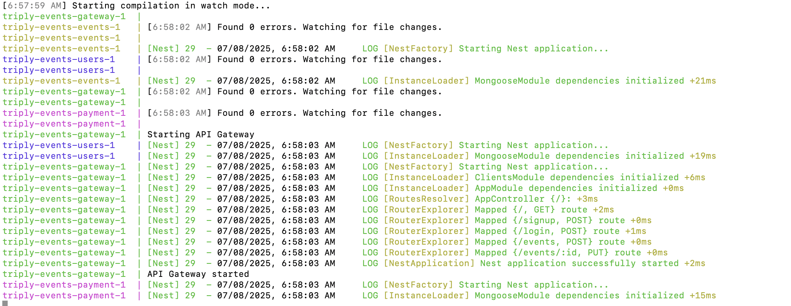

## About
This project simulates an events company that allows users to reserve and pay for the listed events. The code is organized as a microservice, with the following components:
1. API gateway - manages access to the underlying microservices
2. events - manages everything to do with events
3. users - manages everything to do with users
4. payment - allows users to pay for a reserved event (Uses Pesapal, but other providers can be added as well)

## Running the system
1. Open your terminal. Make sure you are in the root directory
2. Create a .env file in the root directory. Some of the expected values are documented in the .env.example file
2. Run `docker compose up --build`. The output on your terminal should ressemble the image below:

